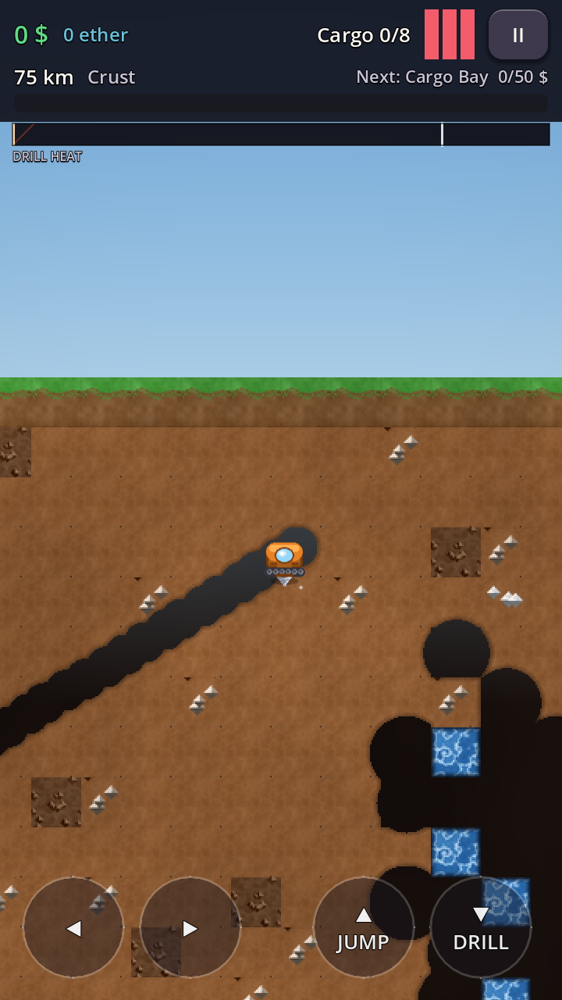

# MineDriller

A landscape browser mining game built with **Godot 4.x**, exported to **Web** (WebGL2), implementing
the Game Design Document by **Dhairya Sheel Rawal**: drill down through five layers of the Earth,
manage your drill's heat, collect ores, dodge Government Drillers, sell on the surface, upgrade,
and go deeper.



## The core loop

**Dive → drill → manage heat → collect ores → avoid enemies → return → sell → upgrade → go deeper.**

- **Tutorial** — a new player's first run is a short hand-built level that teaches the whole
  loop once: drill, collect ore, surface, buy the Drill Bit, and drill through the rock it
  unlocks. It's mandatory, can't softlock, and the Drill Bit Lv2 carries into the real game.
- **Contextual tips** — a `?` floats over anything worth explaining the moment you're near it:
  each enemy, magma, water, depots, chests, rock too hard to drill, and your own heat or full
  cargo. Hover to read, click or press **H** to open. Once you've read a tip its `?` is gone for
  good — everywhere, so one read covers every water pocket — and the pause menu's **GUIDE**
  keeps them all readable.
- **Heat / cooldown** — drilling builds heat; idling cools you. The deeper you go, the higher the
  *ambient heat floor* rises, so the usable part of the bar shrinks with depth exactly as the GDD
  describes. Hit 100 and the drill blows: cargo lost, money kept.
- **Five layers** — Crust, Upper Mantle, Lower Mantle, Upper Core, Core. Each layer ends in a
  solid band of harder rock: you need the next **Drill Bit** tier to break through (the GDD's
  upgrade gating).
- **Ores** — Iron 2$ → Silver 8$ → Gold 25$ → Emerald 40$ → Ruby 60$ (+1 ether) → Black Opal 150$
  (+2 ether). Rarer ores cluster near the bottom of each layer.
- **Learn while you dig** — every ore you find for the first time earns a **Discovery Card**
  with real geology: how it forms, where on Earth it's mined, what we use it for. The
  **Geologist's Log** then quizzes you on what you've found and pays ether for correct
  answers. Optional, never punishing — see [docs/EDUCATION.md](docs/EDUCATION.md).
- **Enemies** — Creepy Crawlies patrol, Zombie Miners chase, Government Drillers *confiscate
  your cargo*. Deeper down: **Magma Slugs** cook your drill from a distance, **Crystal Bats**
  swoop erratically, and dormant **Rock Golems** wake up and block your route. Each one
  threatens a different resource, so each needs a different answer.
- **World** — seeded, deterministic, chunk-streamed procedural generation with **organic pixel-carved
  tunnels** (the drill bores smooth round holes, not grid blocks), rounded caves, water pockets
  that actually **flow** (fall into a freshly-drilled opening, spread sideways, instant cooling on
  contact), magma (damage + heat), and hidden treasure vaults.
- **Getting around** — no flying. You walk, jump, and drill. Vertical shafts are one-way drops;
  to climb out you carve diagonal ramps (now a shallower, easier grade), so the route home is
  something you dig and reuse. The pod visibly banks toward whatever direction it's drilling.
- **Safe-spot depots** — 3 per layer (15 total), findable rooms where you can bank ore mid-dive.
  Deposited ore is immune to a bust, but it isn't money yet: withdraw it back into cargo and carry
  it to the surface to sell, same as everything else.
- **Map** — open the in-run map any time to see every chunk you've actually explored; unvisited
  areas stay under fog of war, and depot locations only appear once you've found them.
- **Escape rockets** — you can't drill straight up, so a limited rocket blasts a diagonal
  shaft out when you're stranded. 5 per dive, more via the **Rocket Bay** upgrade. Restocked
  free on surfacing *and* whenever you reach a safe-spot depot, so depots are a genuine
  forward base. Rockets respect your Drill Bit, so they can't punch through a layer gate.
- **Meta** — surface shop with 7 upgrade tracks, resource codex with real geology notes,
  10 achievements, statistics, daily-seed challenge runs, and a
  persistent world: quit mid-dive and **DIVE** resumes your exact position, dug tunnels, and
  cargo. **NEW DRILLING** re-seeds a fresh world while keeping your money, upgrades and stats.

## Running the game

1. Install [Godot 4.3+ (standard build)](https://godotengine.org/download).
2. Open `project.godot` in the Godot editor and press **F5** (or run
   `godot --path .` from this folder).
3. Controls: **A/D or ←/→** move, **S/↓** drill down, **W/↑/Space** jump.
   Push sideways into a wall to drill sideways. **Hold ↑ + a direction** into a wall to
   carve a rising ramp — that's how you climb back to the surface (you can't drill straight
   up). **R/Q** fires an escape rocket diagonally up in the direction you're facing or
   holding. **E/F** opens a nearby safe-spot depot. **H** opens the nearest tip. **P** or **Esc** pauses — and the pause menu lists every
   control, so you never need this page. SHOP, DEPOT and MAP are
   clickable buttons; there are no on-screen D-pads on the web build.

## Running the tests

```
godot --headless --path . res://tests/test_runner.tscn
```

108+ automated checks: balance sanity, world determinism, world-diff save/reload,
layer gating, economy math and the cargo swap, the depot system (deposit/withdraw,
capacity, bust-safety), escape rockets, the tutorial (level economy, gating, step logic,
save sandbox), tip data coverage, tunnel healing,
save round-trip + corruption handling, the heat model, circle-vs-pixel collision, the
water simulation, and a full end-to-end simulated dive (drill down in bursts, carve a
ramp, climb back out) on the real game scene. Exit code 0 = all green.

## Exporting for the web

Use the included **Web** export preset in `export_presets.cfg`. In the Godot editor:
*Project → Export → Web → Export Project*, writing to something like `build/index.html`.

The preset ships with `thread_support=false` on purpose: threaded web builds need
`SharedArrayBuffer`, which requires the host to send COOP/COEP headers. Leaving threads off
means the output is plain static files that work on any host (GitHub Pages, itch.io, S3, a
plain nginx) with no header configuration.

Browsers won't let audio start before a user gesture, so the first sound plays once the
player clicks. Saves go to `user://`, which on web is IndexedDB — persistent per browser
profile, but cleared if the user wipes site data.

> The **Android** preset is still in the file but is no longer maintained: the game is now
> landscape-only with keyboard/mouse input and no on-screen D-pads. See
> [docs/BUILD_ANDROID.md](docs/BUILD_ANDROID.md) for the historical APK steps.

## Project layout

```
assets/           generated textures + audio (see tools/generate_assets.py)
data/balance.json every tunable number in the game (single source of truth)
docs/             architecture, balancing, build & design docs
scenes/           two minimal scenes (menu, game) — all nodes are built in code
scripts/
  autoload/       Balance, Events, SettingsManager, GameState, SaveManager, AudioManager
  world/          procedural world + grid physics
  player/         the drill pod (FSM: drive / drilling / busted)
  enemies/        EnemyBase + Crawly, ZombieMiner, GovtDriller
  game/           run orchestrator + FTUE tutorial level
  ui/             UIKit factory + HUD, shop, menus, popups
tests/            headless automated test suite
tools/            asset generator (Python/PIL) + screenshot runner
```

## Regenerating assets

All art and sound is procedurally generated and committed, so this is optional:

```
python tools/generate_assets.py   # requires Pillow
```

## Documentation

- [docs/ARCHITECTURE.md](docs/ARCHITECTURE.md) — systems, signals, data flow
- [docs/EDUCATION.md](docs/EDUCATION.md) — the teaching design: what kids learn and how
- [docs/VISUALS.md](docs/VISUALS.md) — how the terrain/HUD look is built, and why
- [docs/BALANCING.md](docs/BALANCING.md) — the economy math and pacing model
- [docs/DESIGN_DECISIONS.md](docs/DESIGN_DECISIONS.md) — GDD analysis: gaps found and how they were filled
- [docs/BUILD_ANDROID.md](docs/BUILD_ANDROID.md) — step-by-step APK export
- [docs/EXPANSION.md](docs/EXPANSION.md) — future work guide (bosses, missions, localization, ads)

Design: Dhairya Sheel Rawal · Implementation generated with Claude Code.
